# 🍔 Burger Factory — Frontend

<p align="center">
  
</p>

<p align="center">
  
  
  
  
</p>

<p align="center">
  🇧🇷 Português
</p>

---

Frontend oficial da **Burger Factory**, desenvolvido com **Quasar Framework + Vue 3**, consumindo a API do backend Node.js/Express.

A aplicação foi criada com foco em performance, organização, experiência moderna e fluxo completo de delivery, incluindo cliente, checkout e painel administrativo.

---

# 🚀 Tecnologias utilizadas

- Quasar Framework (Vite)
- Vue 3
- Vue Router
- Pinia
- Fetch API
- Sass (SCSS)
- ESLint
- Prettier

---

# 📋 Requisitos

Antes de iniciar, você precisa ter instalado:

- Node.js 22+
- npm 9+
- Backend Burger Factory rodando

---

# ⚙️ Instalação

Clone o repositório:

```bash
git clone https://github.com/SEU_USUARIO/burger-factory-frontend.git
```

Acesse a pasta:

```bash
cd FRONTEND_BURGUERFACTORY
```

Instale as dependências:

```bash
npm install
```

---

# 🔐 Variáveis de ambiente

Crie um arquivo:

```text
.env
```

na raiz do projeto:

```env
VITE_API_URL=http://localhost:3000
```

Caso não seja definido, o frontend utilizará fallback automático para:

```text
http://localhost:3000
```

---

# ▶️ Executando o projeto

## 🔹 Desenvolvimento

```bash
npm run dev
```

Frontend disponível em:

```text
http://localhost:9000
```

---

## 🔹 Build de produção

```bash
npm run build
```

---

## 🔹 Lint

```bash
npm run lint
```

---

## 🔹 Formatação

```bash
npm run format
```

---

# 📁 Estrutura do projeto

```text
FRONTEND_BURGUERFACTORY/
│
├── docs/
│   └── screenshots/
│
├── public/
│
├── src/
│   ├── assets/
│   │   └── logoburguerfactory.png
│   │
│   ├── css/
│   │   └── app.scss
│   │
│   ├── layouts/
│   │   └── MainLayout.vue
│   │
│   ├── pages/
│   │   ├── LoginPage.vue
│   │   ├── RegisterPage.vue
│   │   ├── MenuPage.vue
│   │   ├── CheckoutPage.vue
│   │   ├── OrdersPage.vue
│   │   ├── OrderStatusPage.vue
│   │   ├── ProfilePage.vue
│   │   ├── AdminOrdersPage.vue
│   │   ├── AdminProductsPage.vue
│   │   └── ErrorNotFound.vue
│   │
│   ├── router/
│   │   ├── index.js
│   │   └── routes.js
│   │
│   └── stores/
│
├── quasar.config.js
└── package.json
```

---

# 🌐 Rotas da aplicação

> O projeto utiliza `vueRouterMode: 'hash'`.

Exemplo local:

```text
http://localhost:9000/#/lanches
```

| Rota | Página | Acesso |
|---|---|---|
| `/` | Redireciona para `/lanches` | Público |
| `/login` | Login | Público |
| `/register` | Cadastro | Público |
| `/lanches` | Cardápio | Público |
| `/checkout` | Checkout | Público |
| `/pedidos` | Lista de pedidos | Público |
| `/pedidos/:orderId` | Acompanhamento do pedido | Público |
| `/perfil` | Perfil do usuário | Logado |
| `/admin` | Redireciona para `/admin/pedidos` | Admin |
| `/admin/pedidos` | Painel admin de pedidos | Admin |
| `/admin/produtos` | Painel admin de produtos | Admin |

---

# 🔗 Integração com backend

A aplicação consome a API através da variável:

```env
VITE_API_URL
```

Exemplo:

```env
VITE_API_URL=http://localhost:3000
```

---

# 📡 Endpoints utilizados

## 🔐 Autenticação

```http
POST /api/auth/login
POST /api/auth/register
GET  /api/auth/verify
```

---

## 🍔 Cardápio

```http
GET /api/menu
```

---

## 🛒 Carrinho

```http
GET    /api/cart
POST   /api/cart/items
PATCH  /api/cart/items/:itemId
DELETE /api/cart/items/:itemId
POST   /api/cart/checkout
```

---

## 📦 Pedidos

```http
GET /api/orders
GET /api/orders/:orderId
```

---

## 👤 Perfil

```http
GET    /api/profile
PUT    /api/profile
DELETE /api/profile

PUT /api/profile/password
PUT /api/profile/avatar
```

---

## 📍 Endereços

```http
GET    /api/profile/addresses
POST   /api/profile/addresses
PUT    /api/profile/addresses/:id
DELETE /api/profile/addresses/:id

PUT /api/profile/addresses/:id/default
```

---

## ⚙️ Administração

```http
GET   /api/admin/orders
PATCH /api/admin/orders/:orderId/status

GET   /api/admin/categories

GET   /api/admin/products
POST  /api/admin/products
PUT   /api/admin/products/:id

PATCH /api/admin/products/:id/status
```

---

# 🔐 Fluxo de autenticação

## ✅ Login com conta

1. Usuário acessa:

```text
/login
```

2. Envia:
- email
- senha

3. O frontend chama:

```http
POST /api/auth/login
```

4. Em sucesso, salva:

```text
localStorage -> bf_session
```

Com:

```json
{
  "mode": "auth",
  "token": "<jwt>",
  "user": {}
}
```

5. Redireciona para:

```text
/lanches
```

---

# 👤 Entrar sem conta

O usuário pode navegar como visitante.

Ao acessar sem login, o frontend cria:

```text
bf_guest_session_id
```

E mantém carrinho/pedidos vinculados à sessão visitante.

---

# 🛒 Fluxo do carrinho

O sistema utiliza:

```text
localStorage
```

para persistência de sessão e carrinho.

## Chaves utilizadas

| Chave | Função |
|---|---|
| `bf_session` | Sessão autenticada ou visitante |
| `bf_guest_session_id` | Identificador do visitante |
| `bf_remember_email` | Email salvo no login |

---

## Evento global

```text
bf-cart-updated
```

Utilizado para sincronizar o drawer do carrinho entre páginas.

---

# 🍟 Cardápio por categorias

A página:

```text
MenuPage.vue
```

organiza os produtos nesta ordem:

1. Combos
2. Hambúrgueres
3. Fritas
4. Bebidas
5. Sobremesas

---

# 💳 Checkout

O checkout suporta:

- Usuário logado
- Visitante
- Carrinho persistente
- Validação de telefone
- Validação de CEP
- Pagamento via:
  - Pix
  - Cartão
  - Dinheiro

Também utiliza:

```http
X-Idempotency-Key
```

para evitar pedidos duplicados.

---

# 📦 Pedidos

O usuário pode:

- visualizar pedidos anteriores
- acompanhar status em tempo real
- visualizar barra de progresso do pedido

---

# 👤 Perfil do usuário

A tela de perfil permite:

- editar dados pessoais
- alterar senha
- enviar avatar
- gerenciar endereços
- definir endereço padrão

---

# ⚙️ Painel administrativo

## 📦 Pedidos

O admin pode:

- filtrar pedidos
- atualizar status
- confirmar entregas
- acompanhar atualizações automáticas

---

## 🍔 Produtos

O admin pode:

- criar produtos
- editar produtos
- fazer upload de imagem
- ativar/inativar produtos
- controlar ordenação (`display_order`)
- buscar e filtrar produtos

---

# 📦 Estrutura dos itens

Cada produto utiliza:

```json
{
  "id": 1,
  "category": "hamburgueres",
  "name": "Classic Factory",
  "description": "Hambúrguer artesanal com cheddar e bacon.",
  "price": "32.90",
  "imageUrl": "/menu/classic-factory.webp"
}
```

---

# 🖼️ Imagens

## 📁 Estrutura recomendada

```text
public/menu/
```

ou:

```text
/uploads/
```

---

## ✅ Exemplos

```text
/menu/factory-smash.webp
/uploads/products/item.webp
```

O frontend monta automaticamente a URL completa usando:

```env
VITE_API_URL
```

---

# 📸 Screenshots das interfaces

Adicione as imagens em:

```text
docs/screenshots/
```

---

## 🔐 Login — Desktop

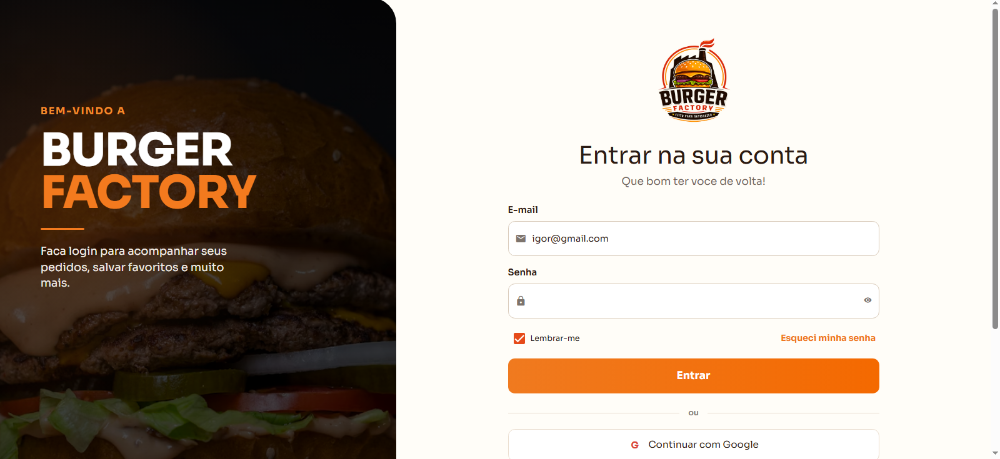

---

## 📱 Login — Mobile

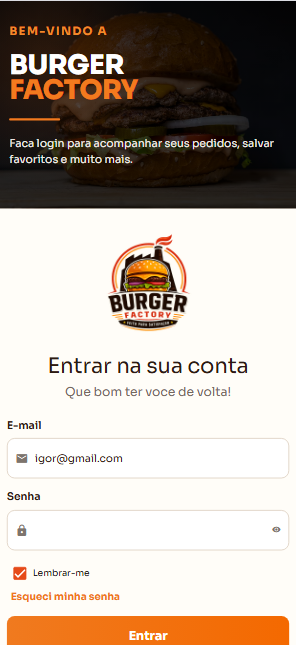

---

## 🖥️ Cardápio — Desktop

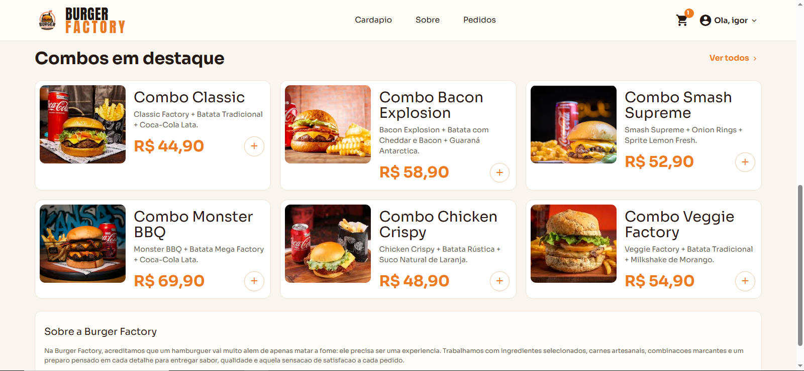

---

## 📱 Cardápio — Mobile

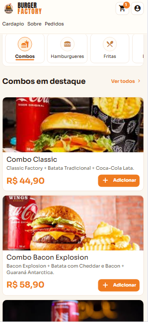

---

## 🖥️ Menu — Desktop

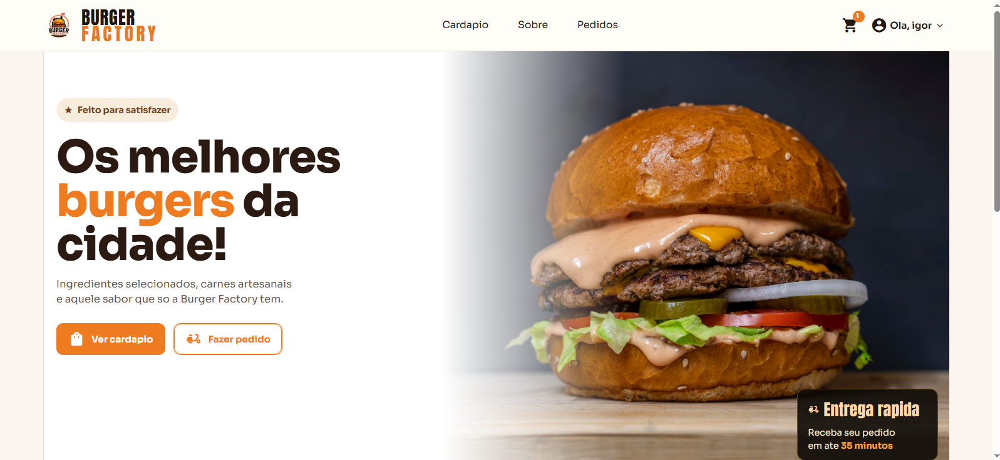

---

## 🛒 Carrinho e Checkout — Desktop

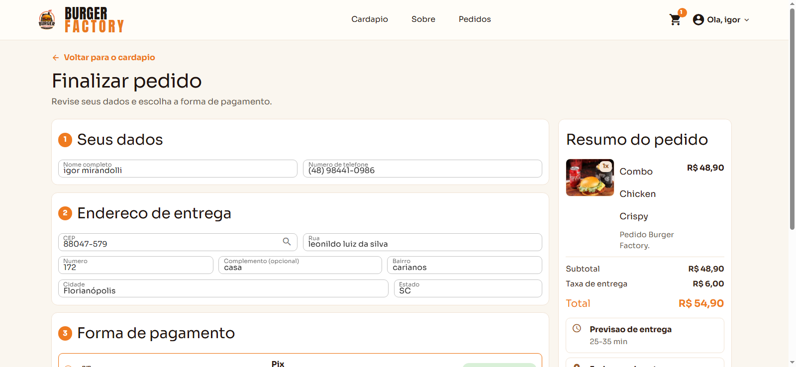

<br />

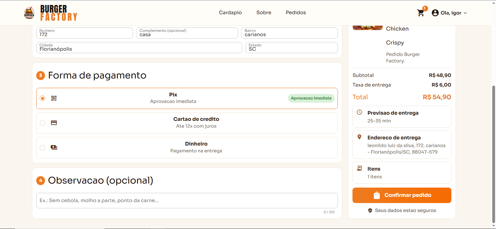

---

## 📱 Carrinho e Checkout — Mobile

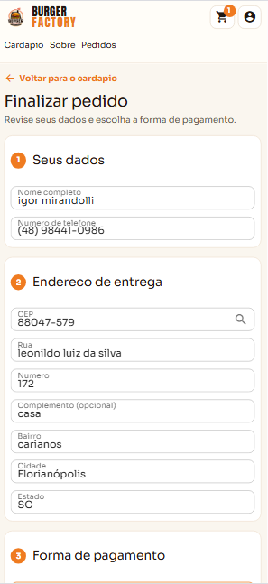

<br />

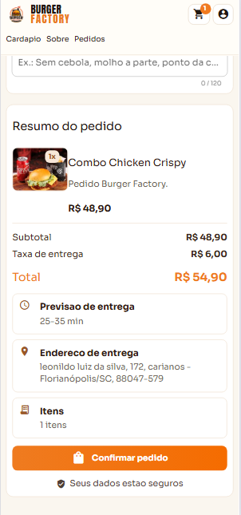

---

## 📦 Pedidos — Desktop

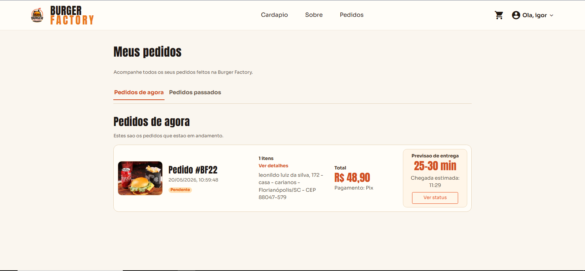

---

## 📱 Pedidos — Mobile

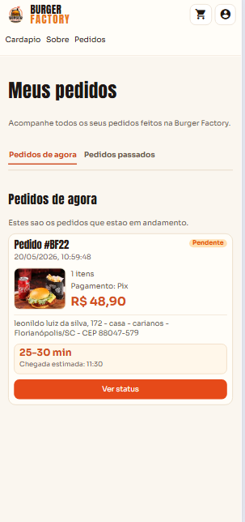

---

## 📦 Status do Pedido — Desktop

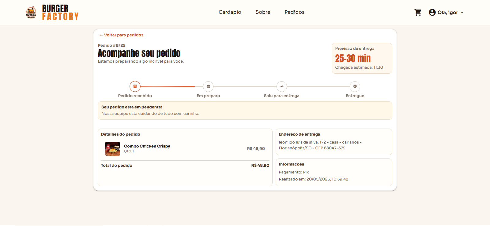

---

## 📱 Status do Pedido — Mobile

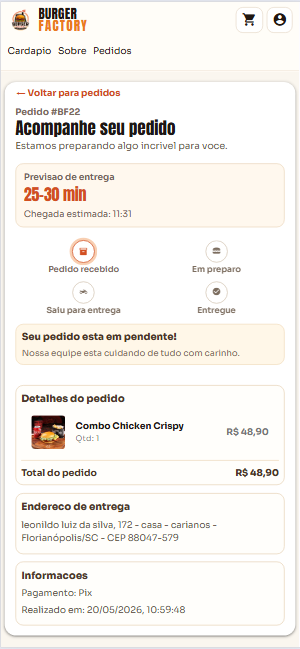

---

## ⚙️ Admin — Pedidos Desktop

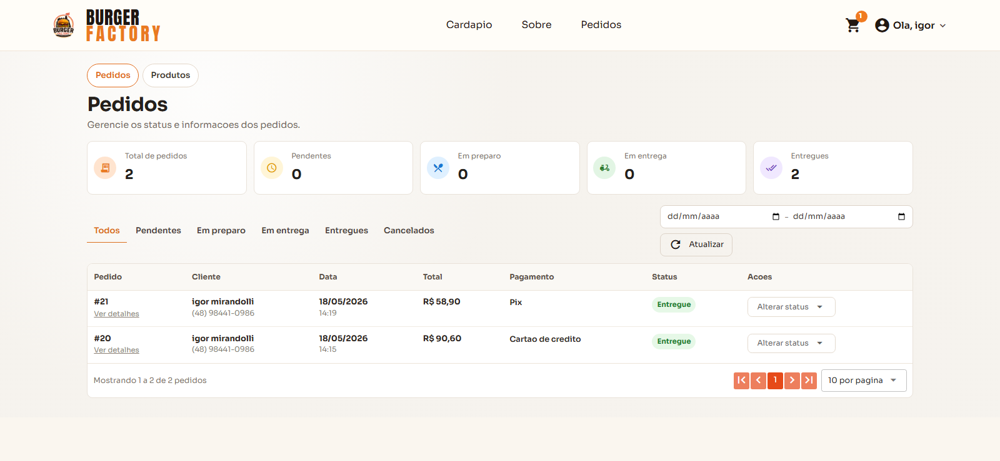

---

## 📱 Admin — Pedidos Mobile

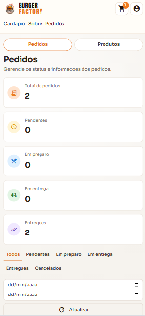

---

## 🍔 Admin — Produtos Desktop

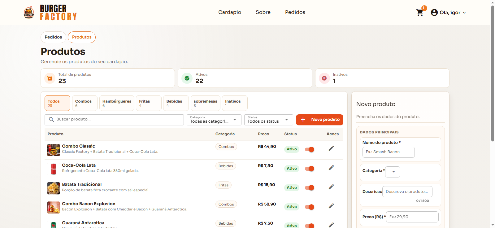

<br />

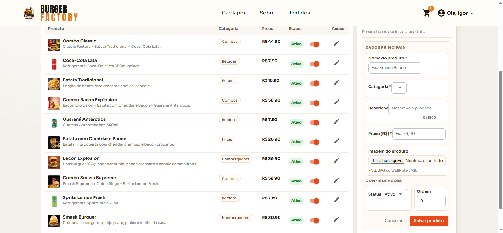

---

## 📱 Admin — Produtos Mobile

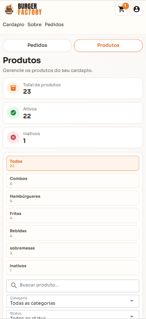

<br />

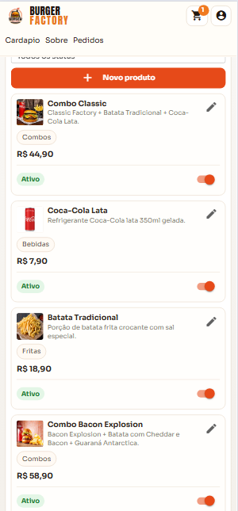

<br />

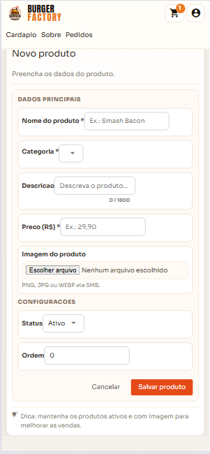

---

## 👤 Perfil — Desktop

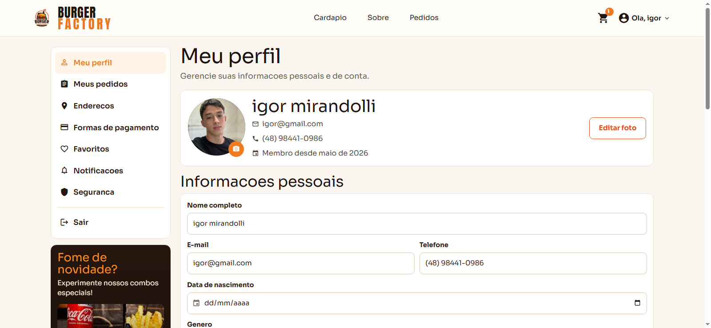

---

## 📱 Perfil — Mobile

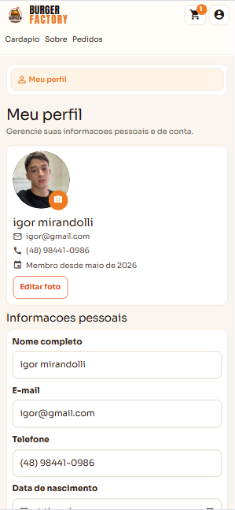

---

# 🎨 Interface

## Header

Visível em todas as páginas, exceto:

```text
/login
/register
```

---

## Navegação principal

| Link | Destino |
|---|---|
| Cardápio | `/lanches` |
| Pedidos | `/pedidos` |
| Perfil | `/perfil` |
| Entrar | `/login` |

---

## Scroll suave

O router utiliza:

```text
scrollBehavior
```

com suporte para:
- âncoras (`#menu`)
- rolagem suave

---

# ⚠️ Problemas comuns

## ❌ `package.json` não encontrado

Você provavelmente está fora da pasta do frontend.

Execute os comandos dentro de:

```text
FRONTEND_BURGUERFACTORY
```

---

## ❌ Login não funciona

Verifique:

- `VITE_API_URL`
- Backend rodando
- CORS configurado corretamente

---

## ❌ Imagens não aparecem

Confirme:

- retorno correto da API
- backend servindo:
  - `/menu`
  - `/uploads`

---

## ❌ 401/403 em rotas admin

Confirme se:

```json
{
  "mode": "auth",
  "user": {
    "role": "admin"
  }
}
```

está salvo em:

```text
bf_session
```

---

## ❌ Carrinho de visitante não funciona

Verifique se:

```text
bf_guest_session_id
```

foi criado corretamente no navegador.

---

# 🚀 Próximos passos

- Integração com gateway de pagamento
- Notificações em tempo real
- Dashboard analítico
- Sistema de cupons
- PWA/mobile
- Upload múltiplo de imagens
- Relatórios administrativos
- Melhorias de performance
- Dark mode

---

# 📜 Scripts disponíveis

| Script | Descrição |
|---|---|
| `npm run dev` | Inicia o frontend |
| `npm run build` | Gera build de produção |
| `npm run lint` | Valida o código |
| `npm run format` | Formata arquivos |

---

# 📄 Licença

Este projeto está sob a licença MIT.

---

# 👨‍💻 Desenvolvedor

Desenvolvido por **Igor Mirandolli**

[](https://github.com/IgorMirandolli)

---

# 🍔 Burger Factory

> Feito para satisfazer.