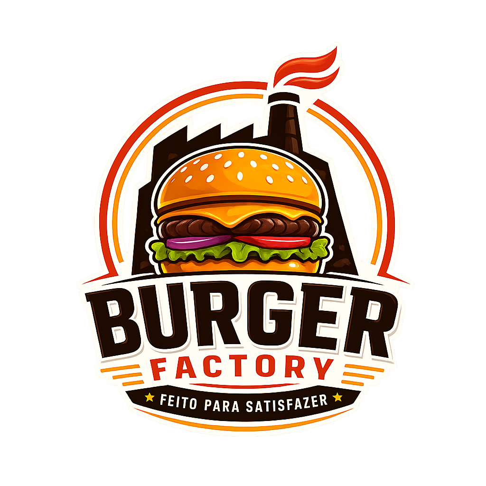

# 🍔 Burger Factory — Frontend

<p align="center">
  
</p>

<p align="center">
  
  
  
  
</p>

<p align="center">
  🇧🇷 Português
</p>

---

Frontend oficial da **Burger Factory**, desenvolvido com **Quasar Framework + Vue 3**, consumindo a API do backend Node.js/Express.

A aplicação foi criada com foco em performance, organização e experiência moderna para delivery de hamburgueria.

---

# 🚀 Tecnologias utilizadas

- Quasar Framework (Vite)
- Vue 3
- Vue Router
- Pinia
- Axios
- Sass (SCSS)

---

# 📋 Requisitos

Antes de iniciar, você precisa ter instalado:

- Node.js 22+
- npm 9+
- Backend Burger Factory rodando

---

# ⚙️ Instalação

Clone o repositório:

```bash
git clone https://github.com/SEU_USUARIO/burger-factory-frontend.git
```

Acesse a pasta:

```bash
cd frontend
```

Instale as dependências:

```bash
npm install
```

---

# 🔐 Variáveis de ambiente

Crie um arquivo:

```text
.env
```

na raiz do projeto:

```env
VITE_API_URL=http://localhost:3000
```

---

# ▶️ Executando o projeto

## 🔹 Desenvolvimento

```bash
npm run dev
```

Frontend disponível em:

```text
http://localhost:9000
```

---

## 🔹 Build de produção

```bash
npm run build
```

---

## 🔹 Lint

```bash
npm run lint
```

---

# 📁 Estrutura do projeto

```text
frontend/
│
├── public/
│   └── menu/
│
├── src/
│   ├── assets/
│   │   └── logoburguerfactory.png
│   │
│   ├── css/
│   │   └── app.scss
│   │
│   ├── layouts/
│   │   └── MainLayout.vue
│   │
│   ├── pages/
│   │   ├── LoginPage.vue
│   │   ├── MenuPage.vue
│   │   └── ErrorNotFound.vue
│   │
│   ├── router/
│   │   ├── index.js
│   │   └── routes.js
│   │
│   └── stores/
│
└── quasar.config.js
```

---

# 🌐 Rotas da aplicação

| Rota | Descrição |
|---|---|
| `/login` | Tela de login |
| `/lanches` | Página principal |
| `/lanches#menu` | Sessão do cardápio |
| `/lanches#sobre` | Sessão sobre a hamburgueria |

---

# 🔗 Integração com backend

A aplicação consome a API através da variável:

```env
VITE_API_URL
```

Exemplo:

```env
VITE_API_URL=http://localhost:3000
```

---

# 📡 Endpoints utilizados

## 🔐 Autenticação

```http
POST /api/auth/login
```

---

## 🍔 Cardápio

```http
GET /api/menu
```

---

# 🔐 Fluxo de autenticação

## ✅ Login com conta

1. Usuário acessa:
```text
/login
```

2. Envia:
- email
- senha

3. O frontend chama:

```http
POST /api/auth/login
```

4. Em sucesso, salva:

```text
localStorage -> bf_session
```

Com:

```json
{
  "mode": "auth",
  "token": "<jwt>",
  "user": {}
}
```

5. Redireciona para:

```text
/lanches
```

---

# 👤 Entrar sem conta

O usuário pode navegar como visitante.

Ao clicar em:

```text
Entrar sem conta
```

O frontend salva:

```json
{
  "mode": "guest",
  "token": null,
  "user": null
}
```

---

# 🍟 Cardápio por categorias

A página:

```text
MenuPage.vue
```

organiza os produtos nesta ordem:

1. Combos
2. Hambúrgueres
3. Fritas
4. Bebidas

---

# 📦 Estrutura dos itens

Cada produto utiliza:

```json
{
  "id": 1,
  "category": "hamburgueres",
  "name": "Classic Factory",
  "description": "Hambúrguer artesanal com cheddar e bacon.",
  "price": "32.90",
  "imageUrl": "/menu/classic-factory.webp"
}
```

---

# 🖼️ Imagens

## 📁 Estrutura recomendada

```text
public/menu/
```

---

## ✅ Exemplo no banco

```text
menu/factory-smash.webp
```

O backend normaliza automaticamente para:

```text
/menu/factory-smash.webp
```

---

# 🎨 Interface

## Header

Visível em todas as páginas, exceto:

```text
/login
```

---

## Navegação do topo

| Link | Destino |
|---|---|
| Cardápio | `/lanches#menu` |
| Sobre | `/lanches#sobre` |
| Entrar | `/login` |

---

## Scroll suave

O router utiliza:

```text
scrollBehavior
```

com suporte para:
- âncoras (`#menu`)
- rolagem suave

---

# ⚠️ Problemas comuns

## ❌ `package.json` não encontrado

Você provavelmente está fora da pasta do frontend.

Execute os comandos dentro de:

```text
FRONTEND_BURGERFACTORY
```

---

## ❌ Login não funciona

Verifique:

- `VITE_API_URL`
- Backend rodando
- CORS configurado corretamente

---

## ❌ Imagens não aparecem

Confirme:

- retorno correto da API
- existência das imagens em:

```text
public/menu/
```

---

# 📜 Scripts disponíveis

| Script | Descrição |
|---|---|
| `npm run dev` | Inicia o frontend |
| `npm run build` | Gera build de produção |
| `npm run lint` | Valida o código |
| `npm run format` | Formata arquivos |

---

# 🚀 Próximos passos

- Filtro por categorias
- Página de detalhes do produto
- Carrinho persistente
- Checkout
- Integração com pagamentos
- Área administrativa
- Dashboard de pedidos
- Responsividade avançada
- PWA/mobile

---

# 📄 Licença

Este projeto está sob a licença MIT.

---

# 👨‍💻 Desenvolvedores

Desenvolvido por **Igor Mirandolli**

[](https://github.com/IgorMirandolli)

---

# 🍔 Burger Factory

> Feito para satisfazer.
